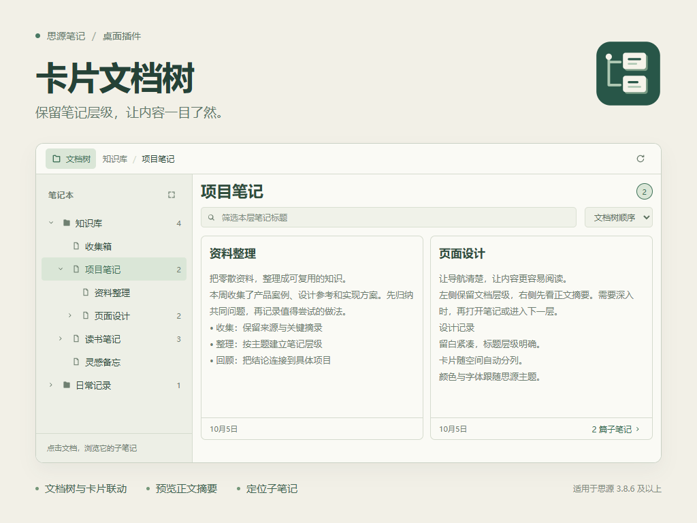

# 卡片文档树

卡片文档树是思源笔记的层级浏览插件。它将笔记本和文档的直接子文档展示为卡片，结合标题、正文摘要、图片与更新时间，帮助用户在打开正文前快速了解笔记内容。



## 功能

- **层级导航**：点击笔记本查看一级文档，点击父文档查看直接子文档；面包屑支持返回任意上层。
- **叶子文档定位**：点击没有子文档的树节点，展示其父级卡片列表并定位对应卡片。
- **内容预览**：卡片展示标题、正文开头的纯文本摘要、首张本地图片和更新时间；无子文档的卡片仅保留日期。
- **文档操作**：点击卡片或当前文档标题打开正文，点击子文档入口进入下一层；文档树菜单支持在指定文档下新建子文档。
- **筛选与排序**：支持本层标题筛选，以及文档树顺序、最近更新和标题排序。
- **工作台与停靠面板**：桌面端提供独立页签和子笔记卡片面板；面板可跟随思源原生文档树的标题点击。
- **响应式布局**：宽屏并排显示文档树和卡片；窄屏切换显示，选中节点后返回卡片。触屏通过节点菜单新建子文档。
- **主题与设置**：跟随思源主题，支持明暗模式、悬浮滚动条，以及可调整的统一卡片高度。
- **状态同步**：保存选择、展开状态与排序；文档变更和同步完成后刷新列表，正文编辑后更新摘要。

## 兼容性

需要思源笔记 **3.8.6 或更高版本**。插件声明支持全部后端与前端，包括桌面客户端、移动客户端及桌面和移动浏览器界面。移动端使用全屏工作台及思源移动端文档打开接口，桌面独立窗口使用对话框工作台。

插件在思源发布服务中禁用（`disabledInPublish: true`）。它展示直接子文档，不将文档内的标题块视为子文档；筛选仅针对当前层级的标题。

## 安装与使用

从 [Releases](https://github.com/5kyfkr/siyuan-plugin-card-tree/releases) 下载 `package.zip`，解压至工作空间的 `data/plugins/siyuan-plugin-card-tree/`，确保 `plugin.json`、`index.js` 和 `index.css` 直接位于插件目录下，然后在思源的插件设置中启用。

桌面端可从顶栏打开“卡片文档树”，或使用右侧的“子笔记卡片”面板。移动端可从插件菜单打开工作台，也可使用停靠面板入口。文档树按钮切换树与卡片；节点箭头控制展开与折叠，点击名称只执行导航。

桌面端右击文档树节点打开菜单，触屏点击节点右侧菜单按钮。在“新建子笔记”对话框中输入标题即可在该文档下创建并打开正文。桌面工作台在右侧打开正文，移动端切换至思源编辑器。

插件设置支持调整卡片高度，默认 `300 px`，范围 `220–640 px`。卡片按可用宽度自动分列，正文摘要超出卡片空间后截断。

## 架构

插件采用原生 JavaScript 与 CSS，运行时依赖思源提供的 `siyuan` 插件 API。

| 模块 | 职责 |
| --- | --- |
| `src/index.js` | 插件生命周期、页签与停靠面板注册、移动端入口、文档打开和设置持久化 |
| `src/api.js` | 思源内核 API 请求、超时与取消控制 |
| `src/store.js` | 文档层级、选择状态、排序、预览缓存与请求调度 |
| `src/view.js` | 文档树、面包屑、卡片、筛选和文档创建界面 |
| `src/content.js` | 文档路径处理与摘要提取 |
| `src/native-tree.js` | 思源原生文档树点击适配 |
| `src/scrollbar.js` | 不占布局宽度的悬浮滚动条 |

### 数据访问

笔记本和文档列表分别通过 `/api/notebook/lsNotebooks` 与 `/api/filetree/listDocsByPath` 获取。可见卡片通过 `/api/filetree/getDoc` 读取开头的文档块，提取最多约 520 字的纯文本摘要。首张图片仅接受本地 `assets/` 路径。

预览按可见范围加载，最多同时执行 4 个请求；每批展示 40 张卡片，可继续加载。插件不扫描磁盘文档文件，不执行 SQL，也不直接插入文档返回的原始 HTML。

创建子文档通过 `/api/filetree/getHPathByID` 获取父级路径，再调用 `/api/filetree/createDocWithMd`，并指定父文档 ID。视图状态保存在插件数据中。

### 宿主适配

内部文档树独立于思源原生树运行。原生树点击跟随集中在独立适配器中，不拦截宿主点击行为。布局依据容器宽度调整，移动端使用 `Dialog` 与 `openMobileFileById`，桌面端使用 `openTab`。

## 开发与发布

使用 Node.js 22：

```sh
npm ci
npm test
npm run build
npm run package
```

`dist/` 为可安装目录，`releases/package.zip` 为标准安装包，同时生成带版本号的安装包。图标和介绍图在构建时校验尺寸与体积。

运行 `npm run dev` 可启动模拟笔记本预览，地址为 `http://127.0.0.1:4178`。预览与插件复用界面和数据状态代码，不连接真实工作空间。

GitHub Actions 在推送 `v*.*.*` 标签或发布对应 Release 时自动执行测试、构建、打包并上传安装包。流水线按标签同步安装包中的版本号。推荐发布步骤：

```sh
node scripts/set-version.mjs 1.0.1
git add plugin.json package.json package-lock.json
git commit -m "chore: release 1.0.1"
git tag v1.0.1
git push origin main v1.0.1
```

## 许可证与致谢

本项目采用 [MIT License](LICENSE)。交互设计参考 [Obsidian Card Workspace](https://github.com/kenanlian/obsidian-card-workspace)，思源数据适配与界面独立实现。
